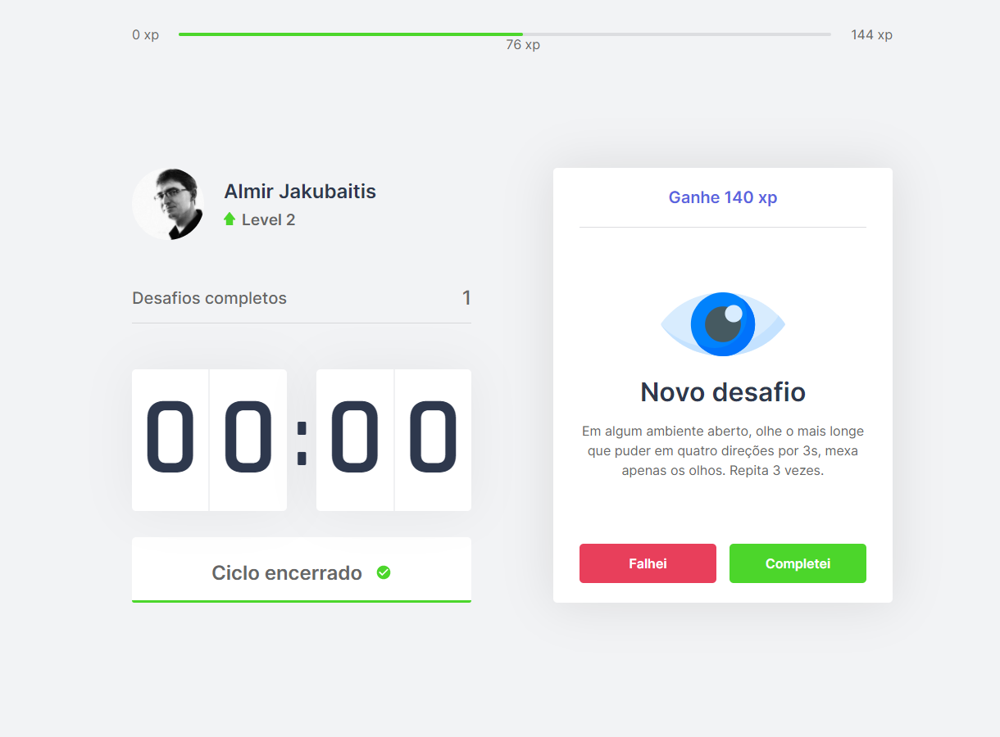

# 2Focus
## Projeto do NLW4 (next level week 4 - rocketseat)

  

Projeto de foco que funde a técnica de pomodoro com a gamificação.
Consiste em criar recompensas a partir de exercícios para foco de desenvolvedores ou entusiastas de computação e design.

## Ver aplicação

Acesse: http://airsky.com.br:5080/

## A Técnica de pomodoro:
Pomodoro é uma técnica simples que aumenta sua produtividade, sua habilidade de gerenciar tempo e de controlar as distrações.
A técnica foi desenvolvida no final dos anos 80 pelo italiano Francesco Cirillo, que procurava uma maneira de aumentar sua produtividade nos estudos durante os primeiros anos de universidade. Para isso, ele utilizou um timer de cozinha para organizar suas tarefas.
A técnica consiste em trabalhar por 20 ou 25 minutos e descansar por outros 5 minutos.

## Gamificação:
A Gamificação é o uso de mecânicas e dinâmicas de jogos para engajar pessoas, resolver problemas e melhorar o aprendizado, motivando ações e comportamentos em ambientes fora do contexto de jogos.
